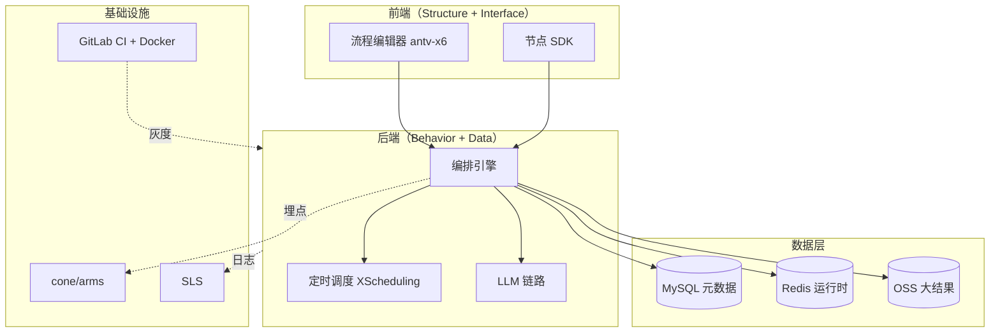

# 案例分享：AI 制表平台（前端负责人 + 部分后端）

> 面试作业 Part 1。从过往工作中挑选最困难、最值得分享的项目，按五层架构（Structure / Behavior / Data Layer / Interface / Infra）展开。

---

## 1. 开场（STAR）

| | |
|---|---|
| **S**ituation | 集团内财务、供应链、仓储等团队每周需要处理大量结构化表格。原流程跨多个系统切换，重复处理逻辑占比 80%+，平均每周 5 小时/人。 |
| **T**ask | 主导设计含"定时任务 + 自动取数 + 智能加工 + 结果推送"的端到端智能体平台，让业务线首次配置后零投入持续运行。 |
| **A**ction | 见下方五层架构（Structure / Behavior / Data Layer / Interface / Infra）。 |
| **R**esult | **6 个团队接入，覆盖 5 个核心场景；制表时间从 5h/张 → 15min/张；累计生成 2 万+ 张报表；每周定时任务约 600+ 个，每周节省 350+ 人日。** |

---

## 2. 五层架构总览



---

## 3. Structure（结构层）

### 3.1 monorepo 拆分

```
packages/
├── web/          # 流程编辑器 + 配置后台（React + Antd + antv-x6）
├── engine/       # 编排引擎核心（Node.js + TS）
├── sdk/          # 节点插件 SDK（供业务方扩展）
└── server/       # Java/MyBatis 后端服务
```

**为什么 monorepo 而不是多仓**：
- 节点 SDK 与 web 之间存在版本耦合（web 编译时依赖 SDK 类型）；多仓需要发包/同步，迭代速度 -50%。
- 跨包重构（如重命名节点协议字段）单仓提交一次即可；多仓需 N 次 PR。

**为什么选 antv-x6 而不是 ReactFlow / GoJS**：
- antv-x6 是国产、有中文文档；可控性高、源码可二次开发。
- 与集团内部 Fusion UI 设计语言一致；不需要为流程图单独造一套主题。

### 3.2 三块核心职责

| 模块 | 职责 | 关键代码 |
|---|---|---|
| 编排引擎 | 解析 DAG、调度节点、状态机、重试 | `engine/state-machine.ts`（`status: idle/running/paused/failed/succeeded`） |
| 节点插件 | 单一职责函数：`input → process → output` | `sdk/contract.ts`（TS 类型 + JSON Schema 双重校验） |
| 流程编辑器 | 拖拽式 DAG 配置 + 节点参数面板 | `web/editor/index.tsx`（基于 antv-x6） |

---

## 4. Behavior（行为层）

### 4.1 节点执行协议

每个节点是一个纯函数：

```ts
type NodeExecutor<TIn, TOut> = (input: TIn, ctx: NodeContext) => Promise<TOut>;
```

- **输入契约**：`engine` 在调用前用 `zod.parse` 校验上游输出。
- **输出契约**：节点返回前用 `zod.parse` 自校验；失败即视为节点失败。
- **Schema 双源**：TS 类型给编辑器提示，JSON Schema 给后端校验；通过 codegen 同源。

### 4.2 失败重试策略

```ts
// engine/retry.ts
const backoff = (attempt: number) => Math.min(2 ** attempt * 1000, 60_000);
const MAX_RETRY = 5;
```

- 指数退避（1s → 2s → 4s → 8s → 16s → 32s，上限 60s）
- 失败 N 次后入死信队列，触发告警（钉钉机器人 @ owner）
- 手动重试从历史快照恢复（不会重新跑上游节点，节省时间）

### 4.3 触发器

| 类型 | 实现 | 案例 |
|---|---|---|
| 定时（cron） | 接入集团内部 `XScheduling` 分布式调度 | 每周一 09:00 跑上周销售汇总 |
| 事件（消息） | 监听上游数据变更 MQ | 商品价格变动触发"差价报告" |
| 手动 | 后台一键运行 | 临时 debug / 补跑 |

---

## 5. Data Layer（数据层）

| 存储 | 内容 | 规模 / 用途 |
|---|---|---|
| MySQL | 任务元数据 / 执行历史 / 依赖图 / 权限隔离 | 关键业务数据，强一致 |
| Redis | 任务运行时中间结果 / 分布式锁 / 去重 key | 高频读写，TTL 自动回收 |
| OSS | 大结果文件（>5MB） | MySQL 仅存 OSS 引用，不存二进制 |

### 5.1 Schema 双源校验

- TS 类型 + JSON Schema 由单一 Zod schema 生成（`scripts/gen-schemas.ts`）
- 节点上线前必须同时提供 TS 类型 + JSON Schema
- 后端在编排引擎入口用 JSON Schema 拒绝非法调用

### 5.2 跨任务依赖图

```
A → B → D
A → C → D
```

- 用邻接表存 MySQL；执行前做拓扑排序检测环
- 循环依赖立即报错，不入调度队列

---

## 6. Interface（接口层）

### 6.1 对外 API

- RESTful + OpenAPI 3.0 文档（自动生成）
- 鉴权：集团内 SSO + 业务方 RBAC（按团队维度隔离）

### 6.2 内部 RPC（节点执行）

- 节点插件以函数式 IPC 调用（同进程内）
- 不同团队节点以 npm 包形式注册到 `plugins/`
- 引擎加载插件时校验签名 + 版本兼容性

### 6.3 前后端契约

- 后端 schema（Zod）→ 脚本生成 TS 类型 → 前端 `import type { Foo } from '@gen/...'`
- 字段重命名 / 删除必须先改 schema，编译期报错，避免线上事故

### 6.4 LLM 链路

- 流式 SSE 输出（前端打字机效果）
- 结构化输出走 `function calling`，schema 与节点输入契约一致
- LLM 失败兜底：返回降级结果 + UI 提示"AI 不确定，请人工确认"

---

## 7. Infra（基础设施）

### 7.1 监控

- 集团内部 `cone/arms` SDK（性能 / 异常 / 行为）
- 自定义埋点：节点耗时分布、失败率分布、LLM 调用成本
- 看板：团队 BI 中订阅，每周 Owner 例会 review

### 7.2 日志

- 结构化日志 → SLS（阿里云日志服务）
- 关键字段：`taskId` / `nodeId` / `attempt` / `durationMs` / `errorCode`
- 日志关联 traceId，可一键从告警跳转到执行现场

### 7.3 CI/CD

- GitLab CI：lint → typecheck → 单测 → 集成测试 → 镜像构建
- Docker 镜像推送到集团 Harbor
- 灰度：按团队维度开关（`config/canary.json`），新功能先开 1 个团队 24h

### 7.4 可观测告警

- 节点失败率 > 5% → 钉钉 @ 节点 owner
- 单任务执行 > 30 分钟 → 钉钉 @ 任务 owner
- LLM 调用成本 > 预算 80% → 钉钉 @ 平台 owner

---

## 8. 关键决策与权衡

| 决策 | 选项 | 选择 | 理由 |
|---|---|---|---|
| 流程图库 | antv-x6 / ReactFlow / GoJS | antv-x6 | 国产 + 中文文档 + 与 Fusion UI 一致 |
| monorepo 工具 | pnpm / yarn / lerna | ppm + pnpm workspaces | 节省磁盘 + 严格的 peerDeps |
| LLM 调用 | function calling / JSON mode | function calling | schema 与节点契约同源 |
| 重试策略 | 固定 / 指数退避 | 指数退避 + 死信队列 | 抗瞬时故障 + 不丢任务 |
| 灰度维度 | 用户 / 团队 / 流量 | 团队 | 业务方天然按团队组织 |

---

## 9. 难点与解决方案

### 9.1 难点 1：节点插件版本兼容

**症状**：A 团队升级插件到 v2，B 团队还在 v1；流程中混合调用导致类型错误。

**方案**：
- 引擎加载时为每个节点锁定版本快照
- 跨版本调用走 `adapter.ts` 做字段映射
- 升级前先跑回归测试套件（节点契约级别）

### 9.2 难点 2：定时任务雪崩

**症状**：周一 09:00 多个团队同时跑定时，数据库连接打满。

**方案**：
- 在引擎入口加分时段令牌桶（`token-bucket.ts`）
- 默认每分钟最多并发 20 个任务；超额排队
- 提供"避峰"开关让团队主动选择非高峰时段

### 9.3 难点 3：LLM 输出不稳定

**症状**：同一 prompt 不同时刻返回 schema 略有差异。

**方案**：
- prompt 模板强约束："严格 JSON，无 markdown，无注释"
- 解析失败自动重试一次（带轻微温度扰动）
- 二次失败入人工审核队列，不阻塞后续节点

---

## 10. 复盘

### 10.1 做对的事

1. **节点契约 schema 双源** —— 几乎消灭了运行时类型错误
2. **失败重试 + 死信队列** —— 抗住过几次下游系统抖动
3. **monorepo** —— 重构代价极低，敢于推大改
4. **业务 Owner 思维** —— 不是"接需求做功能"，而是主动找业务方聊痛点，沉淀出 5 个核心场景

### 10.2 会重做的事

1. **早期就引入契约测试**（pact）—— 避免后期跨团队联调成本
2. **更早引入 OpenTelemetry** —— 现在还是 cone/arms 自家协议，迁移成本高
3. **抽象"业务节点包"概念** —— 现在各团队各写各的相似节点（如"取数 → 加工 → 推送"），应该提供模板节点
4. **可视化调试器** —— 现场排错仍要靠日志 + 重跑，没做到流程图的 replay

---

## 11. 一句话总结

把"重复制表"这种高频低创造的工作，通过编排引擎 + LLM + 定时调度封装成"配置一次，持续产出"的能力 —— 让业务方从"工具使用者"变成"规则定义者"。
